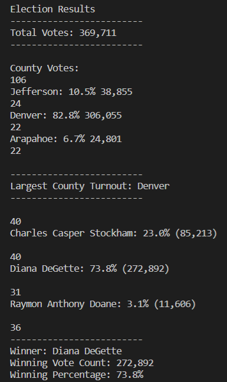

# Election_Analysis

A Colorado Board of Elections employee has given you the following tasks to complet the election audit of a recent local 
congressional election

1. Calculate the total number of votes cas
2. Get a complete list of candidate who received votes.
3. Calculate the total number of votes each candidate received.
4. Calculate the percentage of votes each candidate won.
5. Determine the winner of the election based on populat vote.

##Resources
-Data Source: election results.csv
-Software: Python 3.6., Visual Studio Code, 1.38.1

##Summary
The analysis of the election show that:
- There were "360,711" votes cast in the election.
- The candidates were:
    - Charles Casper Stockham
    - Diana DeGette
    - Raymon Anthony Doane
- The candidate results were:
    - Charles Casper Stockham received "23.0%" of the votes and "85,213" number of votes.
    - Diana DeGette received "73.8%"of the votes and "272,892" number of votes.
    - Raymon Anthony Doane received "3.1%" of the votes and "11,606" number of votes.
- The winner of the election was:
    - Diana DeGette who received "73.8%" of the votes and "85,213" number of votes.

# Challenge Overview
## Overview of Election Audit

The purpose of this project is to complete the election audit with some additional data that has been requested by the election commission. The three data objectives which will be sent are listed below:

    -The voter turnout for each county
    -The percentage of votes from each county out of the total count
    -The county with the highest turnout
    
In order to get this information, loops and conditionals statements with membership and logical operators were used.

## Election Audit Results

There were "369,711" votes cast in the election.
- The counties were:
    - Jefferson
    - Denver
    - Arapahoe
- The breakdown of the the number of votes and percentage for each county in the precinct
    - Jefferson received "10.5%" of the votes and "38,855" number of votes.
    - Denver received "82.8%"of the votes and "306.055" number of votes.
    - Arapahoe received "6.7%" of the votes and "24,801" number of votes.
- The county with the highest turnout
    - Denver who received "82.8%" of the votes and "306.055" number of votes.
- The breakdown of the number of votes and percentage of the total votes each candidate received
    - Charles Casper Stockham received "23.0%" of the votes and "85,213" number of votes.
    - Diana DeGette received "73.8%"of the votes and "272,892" number of votes.
    - Raymon Anthony Doane received "3.1%" of the votes and "11,606" number of votes.
- The winner of the election
    - Diana DeGette who received "73.8%" of the votes and "85,213" number of votes.
     

# Challenge Summary
## Election Audit Summary
The script used for this project could be used for many elections coming. The following examples are going to explain which modifications could be useful.
    - For loading the data csv, we could use the direct or indirect path to get the data. We could use either one as convenient. 
    - It could be displayed the number of votes and percentage of votes of each candidate by county

